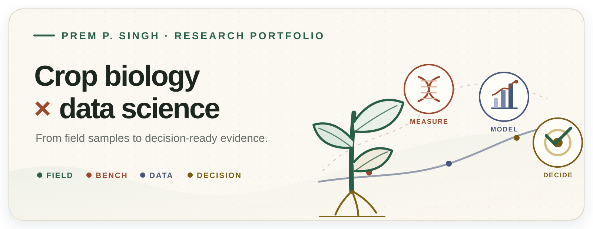
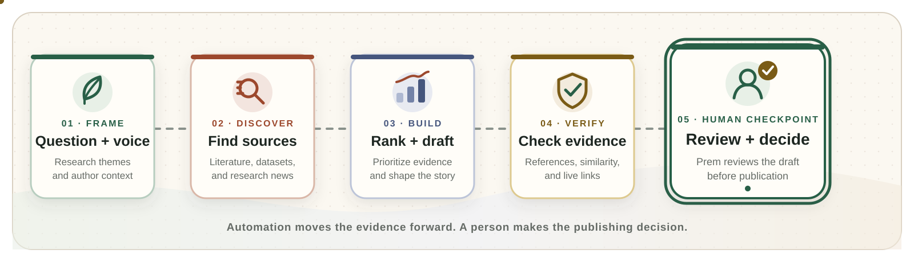

<div align="center">



### A research portfolio built as an evidence system

Field biology, molecular measurement, reproducible computation, and scientific communication—brought together in one living portfolio.

[](https://www.prempsingh.com)
[](https://www.prempsingh.com/#research)
[](https://www.prempsingh.com/methods)
[](https://www.prempsingh.com/gallery)

</div>

---

## 🧭 Explore the portfolio

| | Area | What lives there | Open |
|---|---|---|---|
| 🌿 | **Research** | Crop-disease programs, publications, and project evidence | [View research →](https://www.prempsingh.com/#research) |
| 🧬 | **Methods** | Visual explanations of statistical and biological methods | [Browse methods →](https://www.prempsingh.com/methods) |
| 📊 | **Data stories** | Reproducible analyses translated into clear findings | [Read the data →](https://www.prempsingh.com/data) |
| 🎨 | **Visual Lab** | Research illustrations, charts, maps, and presentation assets | [See the visuals →](https://www.prempsingh.com/gallery) |
| ✍️ | **Field notes** | Short research writing connecting crop biology and data | [Open the blog →](https://www.prempsingh.com/blog) |

---

## 🔁 The evidence pathway

<p align="center">
  <strong>🌿 Observe &nbsp;➜&nbsp; 🔬 Measure &nbsp;➜&nbsp; 🧹 Quality-check &nbsp;➜&nbsp; 📊 Model &nbsp;➜&nbsp; 🎯 Decide</strong>
</p>

The site is organized around one idea: a model is useful only when it remains connected to the crop question, the measurement, and the uncertainty behind it.

<table>
<tr>
<td width="50%" valign="top">
<h3 align="center">🌿 Biology layer</h3>
<p align="center">


</p>
</td>
<td width="50%" valign="top">
<h3 align="center">📊 Data layer</h3>
<p align="center">


</p>
</td>
</tr>
</table>

---

## 🧱 Built as a research system

<table>
<tr>
<td width="50%" valign="top">
<h3 align="center">🎛️ Experience</h3>
<p align="center">Responsive navigation, motion, and interactive storytelling.</p>
<p align="center">


</p>
</td>
<td width="50%" valign="top">
<h3 align="center">📚 Evidence</h3>
<p align="center">Research reports, equations, citations, and reusable content.</p>
<p align="center">


</p>
</td>
</tr>
<tr>
<td width="50%" valign="top">
<h3 align="center">📈 Visualization</h3>
<p align="center">Charts, carousels, research graphics, and visual collections.</p>
<p align="center">


</p>
</td>
<td width="50%" valign="top">
<h3 align="center">🔎 Discovery</h3>
<p align="center">Search-friendly pages and machine-readable research metadata.</p>
<p align="center">


</p>
</td>
</tr>
<tr>
<td width="50%" valign="top">
<h3 align="center">🤖 Workflow</h3>
<p align="center">Review-first research drafting and repository automation.</p>
<p align="center">


</p>
</td>
<td width="50%" valign="top">
<h3 align="center">🚀 Delivery</h3>
<p align="center">Production deployment with environment-managed services.</p>
<p align="center">

</p>
</td>
</tr>
</table>

---

## 🤖 Research writing, with a human checkpoint

The automation assists with discovery and drafting; it does not publish on its own.



<details>
<summary><strong>📁 Open the repository map</strong></summary>

```text
app/                     Routes, metadata, feeds, APIs, and page composition
components/              Interface, charts, and interactive research components
content/                 Blog posts, method reports, and data stories in MDX
profile/                 Publications, projects, experience, skills, and metrics
data-interpretations/    Reproducible analyses and report-specific data
blog_automation/         Assisted research-draft pipeline
lib/                     Content loaders and shared utilities
public/                  CV, images, figures, and downloadable assets
```

</details>

<details>
<summary><strong>💻 Run the portfolio locally</strong></summary>

```bash
npm install
npm run dev
```

Open [http://localhost:3000](http://localhost:3000). Before shipping a change:

```bash
npm run lint
npm run build
```

</details>

---

<div align="center">

### Connect with Prem

[](https://scholar.google.com/citations?user=UGFMZEYAAAAJ&hl=en)
[](https://www.linkedin.com/in/prem-p-singh)
[](https://orcid.org/0000-0001-7921-9379)
[](https://www.researchgate.net/profile/Prem-Singh-12)

**🌿 Field &nbsp;➜&nbsp; 🔬 Bench &nbsp;➜&nbsp; 💻 Data &nbsp;➜&nbsp; 📊 Evidence &nbsp;➜&nbsp; 🎯 Crop decision**

</div>
