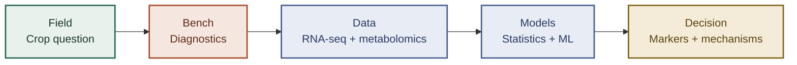

<div align="center">

# prempsingh.com

**Plant science in the field. Data science all the way through.**

Research portfolio of **Dr. Prem Pratap Singh** — a plant scientist and data scientist turning crop measurements, molecular assays, and multi-omics data into decision-ready evidence.

[](https://www.prempsingh.com)
[](https://www.prempsingh.com/explore)
[](https://nextjs.org)
[](https://www.prempsingh.com)

</div>

---

## From crop question to crop decision

The biology defines the question. Data science helps connect the evidence.



| Research signal | Scale |
|---|---:|
| Published journal articles | **38** |
| Book chapters | **22** |
| Google Scholar citations | **2,300+** |
| Google Scholar h-index | **25** |
| Crop samples in the current vineyard study | **300+** |
| Sequencing reads processed | **1.3B+** |

## Data science with biological context

This is not data science applied after the experiment. It is part of the research design—from deciding what to measure to building a result that can be rerun and challenged.

| Layer | What happens there |
|---|---|
| **Measure** | Field sampling, RT-qPCR, digital PCR, RNA-seq, GC-MS, and LC-MS/MS |
| **Engineer** | Reusable Python, R, Bash, Snakemake, SLURM, and Linux/HPC workflows |
| **Analyze** | Differential expression, multi-omics integration, causal mediation, Bayesian inference, and machine learning |
| **Translate** | Diagnostic markers, disease models, mechanism evidence, and crop-management signals |

### Three examples

1. **Grapevine disease:** commercial-vineyard samples → molecular diagnostics and RNA-seq → infection markers and seasonal disease models.
2. **Food safety:** formulation experiments → mixture-design optimization and transcriptomics → sustained toxin control and mechanism evidence.
3. **Public crop data:** open datasets → reproducible normalization and causal models → clear, decision-oriented visual stories.

## Explore the work

| Destination | What you will find |
|---|---|
| [Research](https://www.prempsingh.com/#research) | Publications, citation signals, and the research program |
| [Projects](https://www.prempsingh.com/#projects) | Field-to-evidence case studies with methods and outcomes |
| [Methods](https://www.prempsingh.com/methods) | Visual, reproducible explanations of analytical approaches |
| [Data stories](https://www.prempsingh.com/data) | Public datasets turned into interpretable evidence |
| [Blog](https://www.prempsingh.com/blog) | Plant-disease research notes and visual summaries |
| [Visual lab](https://www.prempsingh.com/gallery) | Research illustrations, charts, maps, and field images |
| [Research farm](https://www.prempsingh.com/explore) | An interactive walk from crop observation to evidence |
| [Journey](https://www.prempsingh.com/journey) | The path from botany to data-guided crop research |

## Under the hood

| Layer | Tools |
|---|---|
| **Application** | Next.js 16, React 19, TypeScript 5 |
| **Interface** | Tailwind CSS 4, Framer Motion, Radix UI, Embla Carousel |
| **3D experience** | Three.js, React Three Fiber, Drei |
| **Research content** | MDX, gray-matter, GFM, KaTeX |
| **Discoverability** | JSON-LD, Open Graph, RSS, and sitemap generation |
| **Automation** | Python, OpenAI API, GitHub Actions, and SMTP notifications |
| **Hosting** | Vercel |

<details>
<summary><strong>How the research-blog pipeline works</strong></summary>

The assisted pipeline creates a pending draft every other Thursday. Nothing is published automatically.

```text
Rotating research themes + author voice profile
                    ↓
arXiv + OpenAlex + Europe PMC + Google News
                    ↓
Source ranking and draft generation
                    ↓
Reference, similarity, and link-reachability checks
                    ↓
Email preview with a GitHub Actions review link
                    ↓
Human review → manual publication
```

Implementation and configuration details live in the [blog automation guide](blog_automation/README.md).

</details>

<details>
<summary><strong>Repository map</strong></summary>

```text
app/                     Next.js routes, metadata, feeds, and API handlers
components/              Interface, visualizations, and interactive experiences
content/blog/            Published research notes in MDX
content/methods/         Method reports in MDX
content/data/            Data stories in MDX
profile/                 Publications, projects, experience, skills, and metrics
data-interpretations/    Reproducible analysis code and report-specific data
blog_automation/         Assisted research-draft pipeline
lib/                     Content loaders and shared utilities
public/                  CV, images, figures, and downloadable assets
.github/workflows/       Draft-generation and manual-publishing workflows
```

</details>

## Run locally

```bash
# Install the web application
npm install

# Start the local development server
npm run dev

# Check code quality and the production build
npm run lint
npm run build
```

The local site is available at [http://localhost:3000](http://localhost:3000).

Optional offline test of the research-draft pipeline:

```bash
python3 -m venv .venv
source .venv/bin/activate
pip install -r blog_automation/requirements.txt
python blog_automation/generate_draft.py --offline
```

## Connect

[](https://scholar.google.com/citations?user=UGFMZEYAAAAJ&hl=en)
[](https://www.linkedin.com/in/prem-p-singh)
[](https://orcid.org/0000-0001-7921-9379)
[](https://www.researchgate.net/profile/Prem-Singh-12)

---

<div align="center">
<sub>Built around one principle: the crop stays central while the evidence grows deeper.</sub>
</div>
